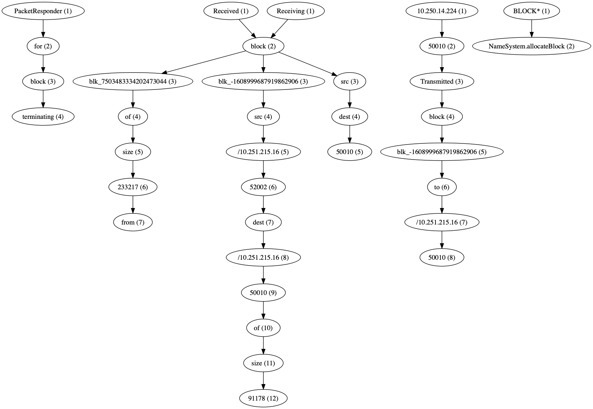

# Spell

Use python implement [the paper](https://www.cs.utah.edu/~lifeifei/papers/spell.pdf) `Spell: Streaming Parsing of System Event Logs` from Min Du, Feifei Li @University of Utah.

This implement is refactored and enhancement version of logpai's [logparser](https://github.com/logpai/logparser).

## Getting Started

```python
python example.py
```

After executing the line above, the `result` folder will be created and you will see two files: `structured.csv` and `templates.csv`.

&nbsp;

+ `*_main_structured.csv`

| ... | Level | Component                    | Content                                                                                       | EventId  | EventTemplate                                                       | ParameterList                              |
|-----|-------|------------------------------|-----------------------------------------------------------------------------------------------|----------|---------------------------------------------------------------------|--------------------------------------------|
| ... | INFO  | dfs.DataNode$DataXceiver     | Receiving block blk_-1608999687919862906 src: /10.250.19.102:54106 dest: /10.250.19.102:50010 | f57d69cf | Receiving block blk_-1608999687919862906 src <*> <*> dest <*> 50010 | ['/10.250.19.102:54106', '/10.250.19.102'] |
| ... | INFO  | dfs.DataNode$PacketResponder | PacketResponder 1 for block blk_-1608999687919862906 terminating                              | 7b619377 | PacketResponder <*> for block blk_-1608999687919862906 terminating  | ['1']                                      |
| ... | INFO  | dfs.DataNode$DataXceiver     | Receiving block blk_-1608999687919862906 src: /10.250.10.6:40524 dest: /10.250.10.6:50010     | f57d69cf | Receiving block blk_-1608999687919862906 src <*> <*> dest <*> 50010 | ['/10.250.10.6:40524', '/10.250.10.6']     |

&nbsp;

+ `*_main_templates.csv`

| EventId  | EventTemplate                                  | Occurrences |
|----------|------------------------------------------------|-------------|
| 6af214fd | Receiving block <*> src <*> <*> dest <*> 50010 | 5           |
| 26ae4ce0 | BLOCK* NameSystem.allocateBlock <*>            | 2           |
| dc2c74b7 | PacketResponder <*> for block <*> terminating  | 4           |

&nbsp;

As you see, there have three test log files. Use for loop to simulate (nearly) streaming situation.

In the `result` folder, there are `_main_*.csv` files and `*.log_*.csv` files. The `_main_*.csv` files will keep appending the new coming log when it has been parse.

## Plot

We can use [graphviz](https://github.com/xflr6/graphviz) to visualize the tree-structured of the parser.

```pythonn
python plot_tree.py
```

&nbsp;



## Tests

```sh
sh test.sh
```

| Name               | Stmts | Miss | Cover |
|--------------------|-------|------|-------|
| spell/__init__.py  | 0     | 0    | 100%  |
| spell/spell.py     | 320   | 207  | 35%   |
| test/test_spell.py | 55    | 1    | 98%   |
| TOTAL              | 375   | 208  | 45%   |

## TODO

- [ ] Refactor `spell.py`
- [ ] Test coverage
